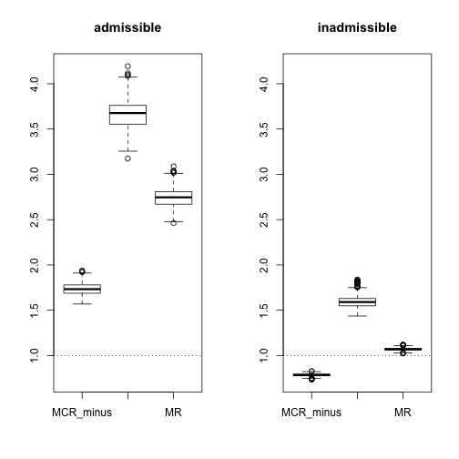

# Reliance of criminal recidivism prediction models on race and sex

### Process data

* Open dataset, 
* identify data subset (`S_ind`), 
* create features, and
* identify sets of variables for which to study reliance (`p1_sets`)


```r
library(dplyr)
multiple_variable_splits <- FALSE

if(!dir.exists('R_output_files')) dir.create('R_output_files')

dat <- read.csv(
		'compas-scores-two-years-violent.csv') %>%
		# 'compas-scores-two-years.csv') %>% 
			#!! ProPublica has published 2 csvs for violent v non violent
			# although there is not extensive documentation on 
			# why one sample is smaller
        filter(days_b_screening_arrest <= 30) %>%
        filter(days_b_screening_arrest >= -30) %>%
        filter(is_recid != -1) %>%
        filter(c_charge_degree != "O") %>%
        filter(score_text != 'N/A')
    #filters as suggested for removing poor quality measurements, see below
        # https://github.com/propublica/compas-analysis/blob/master/Compas%20Analysis.ipynb
dim(dat)
```

```
## [1] 4015   54
```

```r
dat$sex_Male <- dat$sex == 'Male'
dat$c_charge_degree_F <- dat$c_charge_degree == 'F'


colnames(dat)
```

```
##  [1] "id"                      "name"                   
##  [3] "first"                   "last"                   
##  [5] "compas_screening_date"   "sex"                    
##  [7] "dob"                     "age"                    
##  [9] "age_cat"                 "race"                   
## [11] "juv_fel_count"           "decile_score"           
## [13] "juv_misd_count"          "juv_other_count"        
## [15] "priors_count"            "days_b_screening_arrest"
## [17] "c_jail_in"               "c_jail_out"             
## [19] "c_case_number"           "c_offense_date"         
## [21] "c_arrest_date"           "c_days_from_compas"     
## [23] "c_charge_degree"         "c_charge_desc"          
## [25] "is_recid"                "r_case_number"          
## [27] "r_charge_degree"         "r_days_from_arrest"     
## [29] "r_offense_date"          "r_charge_desc"          
## [31] "r_jail_in"               "r_jail_out"             
## [33] "violent_recid"           "is_violent_recid"       
## [35] "vr_case_number"          "vr_charge_degree"       
## [37] "vr_offense_date"         "vr_charge_desc"         
## [39] "type_of_assessment"      "decile_score.1"         
## [41] "score_text"              "screening_date"         
## [43] "v_type_of_assessment"    "v_decile_score"         
## [45] "v_score_text"            "v_screening_date"       
## [47] "in_custody"              "out_custody"            
## [49] "priors_count.1"          "start"                  
## [51] "end"                     "event"                  
## [53] "two_year_recid"          "two_year_recid.1"       
## [55] "sex_Male"                "c_charge_degree_F"
```

```r
apply(dat,2,function(x) mean(is.na(x)))
```

```
##                      id                    name                   first 
##               0.0000000               0.0000000               0.0000000 
##                    last   compas_screening_date                     sex 
##               0.0000000               0.0000000               0.0000000 
##                     dob                     age                 age_cat 
##               0.0000000               0.0000000               0.0000000 
##                    race           juv_fel_count            decile_score 
##               0.0000000               0.0000000               0.0000000 
##          juv_misd_count         juv_other_count            priors_count 
##               0.0000000               0.0000000               0.0000000 
## days_b_screening_arrest               c_jail_in              c_jail_out 
##               0.0000000               0.0000000               0.0000000 
##           c_case_number          c_offense_date           c_arrest_date 
##               0.0000000               0.0000000               0.0000000 
##      c_days_from_compas         c_charge_degree           c_charge_desc 
##               0.0000000               0.0000000               0.0000000 
##                is_recid           r_case_number         r_charge_degree 
##               0.0000000               0.0000000               0.0000000 
##      r_days_from_arrest          r_offense_date           r_charge_desc 
##               0.8560399               0.0000000               0.0000000 
##               r_jail_in              r_jail_out           violent_recid 
##               0.0000000               0.0000000               1.0000000 
##        is_violent_recid          vr_case_number        vr_charge_degree 
##               0.0000000               0.0000000               0.0000000 
##         vr_offense_date          vr_charge_desc      type_of_assessment 
##               0.0000000               0.0000000               0.0000000 
##          decile_score.1              score_text          screening_date 
##               0.0000000               0.0000000               0.0000000 
##    v_type_of_assessment          v_decile_score            v_score_text 
##               0.0000000               0.0000000               0.0000000 
##        v_screening_date              in_custody             out_custody 
##               0.0000000               0.0000000               0.0000000 
##          priors_count.1                   start                     end 
##               0.0000000               0.0000000               0.0000000 
##                   event          two_year_recid        two_year_recid.1 
##               0.0000000               0.0000000               0.0000000 
##                sex_Male       c_charge_degree_F 
##               0.0000000               0.0000000
```

```r
#Preprocessing
library(dplyr)
race_l <- levels(dat$race)

# convert race category to indicator matrix
race_db <- data.frame(intercept=rep(1,dim(dat)[1]))
if(sum(dat$race=='Caucasian')==0) stop('Missing intercept / reference group')
for(j in 1:length(race_l)){
	if(all( dat$race != race_l[j] )) next
	if( 'Caucasian' == race_l[j] ) next #Caucasian is intercept / reference group
	race_db[paste0('race_',race_l[j])] <- (dat$race == race_l[j])+0
}


covariate_subset <- c('sex_Male','priors_count','c_charge_degree_F','age')
outcomes_lab <- c('v_decile_score')


# db_pre = combined processed covariate set we'll be using
db_pre <- cbind(race_db, dat[,covariate_subset]) %>%
	lapply(., as.numeric) %>%
	as.data.frame() %>% as.matrix()

any(is.na(db_pre))
```

```
## [1] FALSE
```

```r
sparse_category_flag <- colSums(db_pre)<400 & apply(db_pre,2,function(z)length(unique(z))<=2)
	#These sparse category checks are required to avoid CV errors
if(any(sparse_category_flag)) warning('Some indicators are sparse. Dropping rows with positive indicators for\n',
	paste(paste(
		colnames(db_pre)[sparse_category_flag],colSums(as.matrix(db_pre[,sparse_category_flag])),
	sep=': '),collapse='\n'))
```

```
## Warning: Some indicators are sparse. Dropping rows with positive indicators for
## race_Asian: 26
## race_Hispanic: 355
## race_Native.American: 7
## race_Other: 254
```

```r
db_sparse_category <- apply(
	(db_pre[,sparse_category_flag])==1,
	1,any)
db <- db_pre[!db_sparse_category ,!sparse_category_flag]
saveRDS(sparse_category_flag,'R_output_files/sparse_categories_dropped.rds')

#tag-filter-sparse
sum(!db_sparse_category)
```

```
## [1] 3373
```

```r
!sparse_category_flag
```

```
##             intercept race_African.American            race_Asian 
##                  TRUE                  TRUE                 FALSE 
##         race_Hispanic  race_Native.American            race_Other 
##                 FALSE                 FALSE                 FALSE 
##              sex_Male          priors_count     c_charge_degree_F 
##                  TRUE                  TRUE                  TRUE 
##                   age 
##                  TRUE
```

```r
set.seed(0)
S_ind <- (1: nrow(db)) %in% sample(nrow(db),500, replace=FALSE)
saveRDS(S_ind,'R_output_files/S_ind.rds')
# head(db[S_ind,])

#tag-num-held-out
sum(!S_ind)
```

```
## [1] 2873
```

```r
# For kernel regression, the intercept is automatically included
db <- db[,!colnames(db)%in%c('intercept')]

# Scale age & priors based on mean & sd in S_ind.	
diag(var(db[S_ind,]))
```

```
## race_African.American              sex_Male          priors_count 
##             0.2477916             0.1848337            17.0617194 
##     c_charge_degree_F                   age 
##             0.2340842           138.6086733
```

```r
scale_variables <- c('priors_count','age')
db[,scale_variables] <- db[,scale_variables] - 
	rep(1,length(S_ind)) %*% t(colMeans(as.matrix(db[S_ind,scale_variables])))
db[,scale_variables] <- db[,scale_variables] / 
	rep(1,length(S_ind)) %*% t(apply(as.matrix(db[S_ind,scale_variables]),2,sd))
apply(db,2,range)
```

```
##      race_African.American sex_Male priors_count c_charge_degree_F
## [1,]                     0        0   -0.6299352                 0
## [2,]                     1        1    8.5697337                 1
##            age
## [1,] -1.434442
## [2,]  3.831747
```

```r
diag(var(db[S_ind,]))
```

```
## race_African.American              sex_Male          priors_count 
##             0.2477916             0.1848337             1.0000000 
##     c_charge_degree_F                   age 
##             0.2340842             1.0000000
```

```r
round(colMeans(db[S_ind,]), 6)
```

```
## race_African.American              sex_Male          priors_count 
##                 0.552                 0.756                 0.000 
##     c_charge_degree_F                   age 
##                 0.628                 0.000
```

```r
saveRDS(db,'R_output_files/processed_features_full.rds')
saveRDS(dat[!db_sparse_category,outcomes_lab],'R_output_files/processed_outcomes_full.rds')


#Sets of variables for which to consider model reliance
admissible <- c('priors_count', 'c_charge_degree_F', 'age')
if(!multiple_variable_splits) p1_names <- list(
  'admissible'=admissible,
  'inadmissible'=setdiff(colnames(db),admissible))
if(multiple_variable_splits) p1_names <- list(
	'admissible'=admissible,
	'inadmissible'=setdiff(colnames(db),admissible),
	'priors_count'='priors_count',
	'c_charge_degree_F'='c_charge_degree_F',
	'age'='age',
	'sex_Male'='sex_Male',
	'race_African.American'='race_African.American'
	)
(  p1_sets <- lapply(p1_names, function(z) which(colnames(db)%in%z))  )##numeric indeces
```

```
## $admissible
## [1] 3 4 5
## 
## $inadmissible
## [1] 1 2
```

```r
lapply(p1_sets, function(z) colnames(db)[z]) #show variable subsets
```

```
## $admissible
## [1] "priors_count"      "c_charge_degree_F" "age"              
## 
## $inadmissible
## [1] "race_African.American" "sex_Male"
```

```r
saveRDS(p1_sets,'R_output_files/p1_sets.rds')

save.image('R_output_files/all_output_process.rdata')
```


### Train 

Train on a data subset to obtain a regularization threshold, a reference model, and models to use in AR.


```r
set.seed(0)

rm(list=ls())
library(dplyr)
library(pbapply)
p1_sets <- readRDS('R_output_files/p1_sets.rds')
S_ind <- readRDS('R_output_files/S_ind.rds')
X <- readRDS('R_output_files/processed_features_full.rds')[S_ind,]
outcomes <- readRDS('R_output_files/processed_outcomes_full.rds')[S_ind]
colnames(X)
```

```
## [1] "race_African.American" "sex_Male"              "priors_count"         
## [4] "c_charge_degree_F"     "age"
```

```r
N<-dim(X)[1]

y <- as.numeric(outcomes)

if(N!=500 | length(y)!=500) stop('error in sampling') #redundant workcheck
sparse_category_flag <- colSums(X)<5 & apply(X,2,function(z)length(unique(z))<=2)
if(any(sparse_category_flag)) warning('Some indicators are sparse.\n',
	paste(paste(
		colnames(X)[sparse_category_flag],colSums(as.matrix(X[,sparse_category_flag])),
	sep=': '),collapse='\n'))
# This would be unexpected since we have already dropped sparse categories above

p <- dim(X)[2]

colMeans(X)
```

```
## race_African.American              sex_Male          priors_count 
##          5.520000e-01          7.560000e-01          2.900458e-17 
##     c_charge_degree_F                   age 
##          6.280000e-01          1.525030e-16
```

```r
diag(var(X))
```

```
## race_African.American              sex_Male          priors_count 
##             0.2477916             0.1848337             1.0000000 
##     c_charge_degree_F                   age 
##             0.2340842             1.0000000
```

```r
apply(X,2,range)
```

```
##      race_African.American sex_Male priors_count c_charge_degree_F
## [1,]                     0        0   -0.6299352                 0
## [2,]                     1        1    5.9066716                 1
##            age
## [1,] -1.264565
## [2,]  3.322116
```

```r
#   _______      __
#  / ____\ \    / /
# | |     \ \  / /
# | |      \ \/ /
# | |____   \  /
#  \_____|   \/
#
#   Cross-validate

library(kernlab)
library(mcr)

# tr denotes "training" data
mu_tr <- mean(y)

len_s <- 40

sigma_seq <- p^seq(-5,5,length=len_s)
cv_err_sigma_regression <- rep(NA,len_s)
pb <- txtProgressBar(min = 1, max = len_s, char = "=", 
        style = 3)
for(i in 1:len_s){
	try({ # may be singular, in which case sigma is too small
		cv_err_sigma_regression[i] <- CV_kernel(y=y,X=X, type='regression',
			kern_fun=rbfdot(sigma_seq[i]),
			dat_ref=NA, n_folds=5, warn_internal=FALSE)
	})
	setTxtProgressBar(pb, i)
}
```

```
## 
  |                                                                       
  |                                                                 |   0%
  |                                                                       
  |==                                                               |   3%
  |                                                                       
  |===                                                              |   5%
  |                                                                       
  |=====                                                            |   8%
  |                                                                       
  |=======                                                          |  10%
  |                                                                       
  |========                                                         |  13%
  |                                                                       
  |==========                                                       |  15%
  |                                                                       
  |============                                                     |  18%
  |                                                                       
  |=============                                                    |  21%
  |                                                                       
  |===============                                                  |  23%
  |                                                                       
  |=================                                                |  26%
  |                                                                       
  |==================                                               |  28%
  |                                                                       
  |====================                                             |  31%
  |                                                                       
  |======================                                           |  33%
  |                                                                       
  |=======================                                          |  36%
  |                                                                       
  |=========================                                        |  38%
  |                                                                       
  |===========================                                      |  41%
  |                                                                       
  |============================                                     |  44%
  |                                                                       
  |==============================                                   |  46%
  |                                                                       
  |================================                                 |  49%
  |                                                                       
  |=================================                                |  51%
  |                                                                       
  |===================================                              |  54%
  |                                                                       
  |=====================================                            |  56%
  |                                                                       
  |======================================                           |  59%
  |                                                                       
  |========================================                         |  62%
  |                                                                       
  |==========================================                       |  64%
  |                                                                       
  |===========================================                      |  67%
  |                                                                       
  |=============================================                    |  69%
  |                                                                       
  |===============================================                  |  72%
  |                                                                       
  |================================================                 |  74%
  |                                                                       
  |==================================================               |  77%
  |                                                                       
  |====================================================             |  79%
  |                                                                       
  |=====================================================            |  82%
  |                                                                       
  |=======================================================          |  85%
  |                                                                       
  |=========================================================        |  87%
  |                                                                       
  |==========================================================       |  90%
  |                                                                       
  |============================================================     |  92%
  |                                                                       
  |==============================================================   |  95%
  |                                                                       
  |===============================================================  |  97%
  |                                                                       
  |=================================================================| 100%
```

```r
plot(y=cv_err_sigma_regression, x=log(sigma_seq))
```


```r
sigma_regression <- sigma_seq[which(cv_err_sigma_regression==min(cv_err_sigma_regression, na.rm=TRUE))]

#When bandwidth is too small, some test points may not be close to *any* reference point,
#which can lead to NaNs and zeros in the kernel regression.
#This is why some elements of cv_err_sigma_regression are NaN

kern_fun <- rbfdot(sigma_regression)

# Note, some rows of X are identical.
# These will be automatically dropped from 
# reference matrices
mean(duplicated(X))
```

```
## [1] 0.196
```

```r
len_a <- 40
alpha_seq <- 10^seq(-4,2,length=len_a)
cv_KLS <- rep(NA,len_a)
pb <- txtProgressBar(min = 1, max = len_a, char = "=", 
        style = 3)

for(i in 1:len_a){
	try({
		cv_KLS[i] <- CV_kernel(y=y-mu_tr,X=X,alpha=alpha_seq[i], type='RKHS',
		kern_fun=kern_fun, dat_ref=NA, n_folds=10,
		warn_internal=FALSE, warn_psd=FALSE, warn_duplicate = FALSE)
	})
	setTxtProgressBar(pb, i)
}
```

```
## 
  |                                                                       
  |                                                                 |   0%
  |                                                                       
  |==                                                               |   3%
  |                                                                       
  |===                                                              |   5%
  |                                                                       
  |=====                                                            |   8%
  |                                                                       
  |=======                                                          |  10%
  |                                                                       
  |========                                                         |  13%
  |                                                                       
  |==========                                                       |  15%
  |                                                                       
  |============                                                     |  18%
  |                                                                       
  |=============                                                    |  21%
  |                                                                       
  |===============                                                  |  23%
  |                                                                       
  |=================                                                |  26%
  |                                                                       
  |==================                                               |  28%
  |                                                                       
  |====================                                             |  31%
  |                                                                       
  |======================                                           |  33%
  |                                                                       
  |=======================                                          |  36%
  |                                                                       
  |=========================                                        |  38%
  |                                                                       
  |===========================                                      |  41%
  |                                                                       
  |============================                                     |  44%
  |                                                                       
  |==============================                                   |  46%
  |                                                                       
  |================================                                 |  49%
  |                                                                       
  |=================================                                |  51%
  |                                                                       
  |===================================                              |  54%
  |                                                                       
  |=====================================                            |  56%
  |                                                                       
  |======================================                           |  59%
  |                                                                       
  |========================================                         |  62%
  |                                                                       
  |==========================================                       |  64%
  |                                                                       
  |===========================================                      |  67%
  |                                                                       
  |=============================================                    |  69%
  |                                                                       
  |===============================================                  |  72%
  |                                                                       
  |================================================                 |  74%
  |                                                                       
  |==================================================               |  77%
  |                                                                       
  |====================================================             |  79%
  |                                                                       
  |=====================================================            |  82%
  |                                                                       
  |=======================================================          |  85%
  |                                                                       
  |=========================================================        |  87%
  |                                                                       
  |==========================================================       |  90%
  |                                                                       
  |============================================================     |  92%
  |                                                                       
  |==============================================================   |  95%
  |                                                                       
  |===============================================================  |  97%
  |                                                                       
  |=================================================================| 100%
```

```r
plot(log(alpha_seq,base=10),cv_KLS, type='l', ylim=c(0,var(y)*2))
abline(h=var(y),lty=2)
abline(h=min(cv_KLS, na.rm=TRUE),lty=3, col='blue')
abline(h=min(cv_err_sigma_regression, na.rm=TRUE),lty=3, col='green')
```


```r
min_cv_loss <- min(cv_KLS,na.rm=TRUE)
alpha_cv <- alpha_seq[which(cv_KLS==min_cv_loss)[1]]


K_D <- as.matrix(kernelMatrix(x=X,kernel=kern_fun))
eK_D <- eigen(K_D)
tail(cumsum(eK_D$values^2)/sum(eK_D$values^2),20)
```

```
##  [1] 1 1 1 1 1 1 1 1 1 1 1 1 1 1 1 1 1 1 1 1
```

```r
head(cumsum(eK_D$values^2)/sum(eK_D$values^2),20)
```

```
##  [1] 0.3249358 0.4497476 0.5433857 0.6060637 0.6485857 0.6847279 0.7180831
##  [8] 0.7486006 0.7746318 0.7979127 0.8149189 0.8311560 0.8443782 0.8564035
## [15] 0.8677086 0.8779859 0.8879124 0.8956604 0.9029879 0.9101545
```

```r
###### Train f_s reference model
X_ref <- X[!duplicated(X),]
system.time({
	ssts_tr <- get_suff_stats_kernel( y=y-mu_tr, X=X,kern_fun=kern_fun,dat_ref=X_ref)
	w_ref <- fit_lm_regularized(suff_stats =ssts_tr, tol = 10^-9, alpha = alpha_cv)
})
```

```
## Warning in get_suff_stats_kernel(y = y - mu_tr, X = X, kern_fun =
## kern_fun, : singular K_D, last 3 eigenvalues are 1.72801e-15; 4.12707e-16;
## 2.71864e-17 . Adding 2e-10 to diagonal
```

```
##    user  system elapsed 
##   0.400   0.016   0.433
```

```r
(r_constraint <- norm_RKHS(model=w_ref, K_D=ssts_tr$reg_matrix))
```

```
##          [,1]
## [1,] 177.7997
```

```r
### Algorithm Reliance - RKHS
AR_kernel_tr <- lapply(p1_sets, function(p1){
	#!! For somplicity, no repeating CV here
	X_drop_p1 <- X[,-p1]
	X_ref_drop_p1 <- X_drop_p1[!duplicated(X_drop_p1),] #this is now a categorical model
	ssts_drop_p1_tr <- get_suff_stats_kernel( y=y-mu_tr, X=X_drop_p1,kern_fun=kern_fun,dat_ref=X_ref_drop_p1)
	w_drop_p1_AR <- fit_lm_regularized(suff_stats =ssts_drop_p1_tr, tol = 10^-9, reg_threshold = r_constraint)
	return(list(w=w_drop_p1_AR, X_ref=X_ref_drop_p1))
})
```

```
## Warning in get_suff_stats_kernel(y = y - mu_tr, X = X_drop_p1, kern_fun
## = kern_fun, : singular K_D, last 3 eigenvalues are -5.69767e-16;
## -2.88878e-15; -5.20968e-15 . Adding 2e-10 to diagonal
```

```r
### Algorithm Reliance - lm
	# When modelling just race & sex, 
	# we use a saturated linear model rather than a kernel model.
X_tr_sex_race_factor <- as.factor(apply(X[,p1_sets$inadmissible], 1, 
	function(zz) paste(zz,collapse='-')))
X_tr_sex_race_matrix <- sapply(levels(X_tr_sex_race_factor), function(lvl){
	as.numeric(X_tr_sex_race_factor==lvl)
})
AR_lm_tr_sex_race <- lm(y~.-1, data=data.frame(cbind(y,X_tr_sex_race_matrix)))


saveRDS(w_ref, 'R_output_files/kern_model_reference.rds')
saveRDS(kern_fun, 'R_output_files/kern_function_reference.rds')
saveRDS(r_constraint, 'R_output_files/kern_norm_constraint.rds')
saveRDS(min_cv_loss, 'R_output_files/min_cv_loss.rds')
saveRDS(mu_tr,'R_output_files/mu_tr.rds')
saveRDS(AR_kernel_tr,'R_output_files/AR_kernel_tr.rds')
saveRDS(AR_lm_tr_sex_race,'R_output_files/AR_lm_tr_sex_race.rds')


save.image('R_output_files/all_output_training.rdata')
```


### MCR

Get MR, AR & MCR on held-out data


```r
rm(list=ls())
set.seed(0) #relevant for bootstrap

library(dplyr)
library(pbapply)
S_ind <- readRDS('R_output_files/S_ind.rds')
X <- readRDS('R_output_files/processed_features_full.rds')[!S_ind,]
outcomes <- readRDS('R_output_files/processed_outcomes_full.rds')[!S_ind]
colnames(X)
```

```
## [1] "race_African.American" "sex_Male"              "priors_count"         
## [4] "c_charge_degree_F"     "age"
```

```r
N<-dim(X)[1]

y <- as.numeric(outcomes)
if(any(!unique(y) %in% c(1:10))) stop('processing error')
p <- dim(X)[2]

if(N!=3373-500 | length(y)!=3373-500) stop('error in sampling')


#  __  __    _____   _____
# |  \/  |  / ____| |  __ \
# | \  / | | |      | |__) |
# | |\/| | | |      |  _  /
# | |  | | | |____  | | \ \
# |_|  |_|  \_____| |_|  \_\
#
# Model class reliance

library(mcr)

w_ref <- readRDS(file='R_output_files/kern_model_reference.rds')
kern_fun <- readRDS(file='R_output_files/kern_function_reference.rds')
r_constraint <- readRDS(file='R_output_files/kern_norm_constraint.rds')
min_cv_loss <- readRDS('R_output_files/min_cv_loss.rds')
mu_tr <- readRDS('R_output_files/mu_tr.rds')
X_ref <- readRDS('R_output_files/processed_features_full.rds')[S_ind,]
X_ref <- X_ref[!duplicated(X_ref),]
p1_sets <- readRDS('R_output_files/p1_sets.rds')


eps_multiplier <- 0.1


# te denotes "test" data rather than "train" (tr)
te_kernel_precomputed <- lapply(p1_sets, function(set){
	precompute_mcr_objects_and_functions(
		y=y-mu_tr, X=X,
		p1=set,
		model_class_loss='kernel_mse',
		loop_ind_args = list(
			reg_threshold=r_constraint,
			kern_fun = kern_fun,
			dat_ref=X_ref,
			nrep_sample=2,
			tol = 10^-8,
			verbose=TRUE,
			warn_psd=TRUE,
			warn_duplicate = TRUE,
			warn_dropped = TRUE)
		)
})
```

```
## Warning in get_suff_stats_kernel(y = y, X = X, p1 = p1, dat_ref =
## loop_ind_args$dat_ref, : singular K_D, last 3 eigenvalues are 1.72801e-15;
## 4.12707e-16; 2.71864e-17 . Adding 2e-08 to diagonal
```

```
## Warning in get_full_sample(y = 1:n, X = cbind(1:n, 1:n), p1 = 1, n = n, : 1
## observation(s) dropped before creating permuted data
```

```
## 
## 
##  crossprod K_perm progress:
## ===========================================================================
```

```
## Warning in get_suff_stats_kernel(y = y, X = X, p1 = p1, dat_ref =
## loop_ind_args$dat_ref, : singular K_D, last 3 eigenvalues are 1.72801e-15;
## 4.12707e-16; 2.71864e-17 . Adding 2e-08 to diagonal

## Warning in get_suff_stats_kernel(y = y, X = X, p1 = p1, dat_ref =
## loop_ind_args$dat_ref, : 1 observation(s) dropped before creating permuted
## data
```

```
## 
## 
##  crossprod K_perm progress:
## ===========================================================================
```

```r
MR_ref_te <- lapply(te_kernel_precomputed, function(pc)
	get_MR_general(model=w_ref,
		precomputed = pc
	))
str(MR_ref_te) #tag-MR-ref-TE
```

```
## List of 2
##  $ admissible  : num 2.78
##  $ inadmissible: num 1.09
```

```r
(loss_ref_te <- get_e0_lm(model = w_ref, suff_stats = te_kernel_precomputed[[1]]$suff_stats))
```

```
## [1] 2.848652
```

```r
(eps_ref_te <- c(loss_ref_te + eps_multiplier * min_cv_loss))
```

```
## [1] 3.1713
```

```r
# tag-w_S-held-out-Err


system.time({
	mcr_te <- lapply(te_kernel_precomputed, function(pc) 
		get_empirical_MCR(eps=eps_ref_te, precomputed = pc, tol_mcr=2^-10)
		)
})
```

```
## 
## 
## MCR- binary search progress:
## ===========================================================================
## 
## MCR+ binary search progress:
## ===========================================================================
```

```
## Warning in getMCR_internal(s = -1, eps = eps, precomputed = precomputed, :
## lower limit reached, result may be conservative
```

```
## 
## 
## MCR- binary search progress:
## 
## 
## MCR+ binary search progress:
## ===========================================================================
```

```
##    user  system elapsed 
##  45.036   2.262  53.865
```

```r
str(lapply(mcr_te, function(zz) zz$range)) #tag-MCR-TE
```

```
## List of 2
##  $ admissible  : num [1:2] 1.77 3.61
##  $ inadmissible: num [1:2] 0.795 1.564
```

```r
# Note - The setting force_lower_0=TRUE means that we do not search for models with (approximately) MR < 1. 
# This can trigger a warning of "lower limit reached." 


n_boot <- 1000
boot_MCR_results <- lapply(p1_sets, function(p1)
	data.frame( MCR_minus=rep(NA,n_boot), 
		MCR_plus=NA, MR=NA))
pb <- txtProgressBar(min = 1, max = n_boot, char = "=", 
        style = 3)
system.time({
for (b in 1:n_boot){
	b_ind <- sample(1:N,N,replace=TRUE)
	X_b <- X[b_ind,]
	y_b <- y[b_ind] #mu_y_s subtracted later


	boot_b_kernel_precomputed <- lapply(p1_sets, function(set){
		precompute_mcr_objects_and_functions(
			y=y_b-mu_tr, X=X_b,
			p1=set,
			model_class_loss='kernel_mse',
			loop_ind_args = list(
				reg_threshold=r_constraint,
				kern_fun = kern_fun,
				dat_ref=X_ref,
				nrep_sample=2,
				tol = 10^-8,
				verbose=FALSE,
				warn_psd=FALSE,
				warn_duplicate = FALSE,
				warn_dropped = FALSE)
			)
	})	

	loss_ref_b <- get_e0_lm(model = w_ref, suff_stats = boot_b_kernel_precomputed[[1]]$suff_stats)
	(eps_ref_b <- c(loss_ref_b + eps_multiplier * min_cv_loss))
	
	mcr_b <- lapply(boot_b_kernel_precomputed, function(pc) 
		get_empirical_MCR(eps=eps_ref_b, precomputed = pc, tol_mcr=2^-6, verbose=FALSE, warn_lower_0=FALSE)#!! different tolerance
		)

	MR_ref_boot <- lapply(boot_b_kernel_precomputed, function(pc)
		get_MR_general(model=w_ref,
			precomputed = pc
	))

	for(nn in names(p1_sets)){
		boot_MCR_results[[nn]]$MCR_minus[b] <- mcr_b[[nn]]$range[1]
		boot_MCR_results[[nn]]$MCR_plus[b] <- mcr_b[[nn]]$range[2]
		boot_MCR_results[[nn]]$MR[b] <- MR_ref_boot[[nn]]
	}

	if( b%%floor(n_boot/10) ==0) setTxtProgressBar(pb, b)
}})
```

```
## 
  |                                                                       
  |======                                                           |  10%
  |                                                                       
  |=============                                                    |  20%
  |                                                                       
  |===================                                              |  30%
  |                                                                       
  |==========================                                       |  40%
  |                                                                       
  |================================                                 |  50%
  |                                                                       
  |=======================================                          |  60%
  |                                                                       
  |=============================================                    |  70%
  |                                                                       
  |====================================================             |  80%
  |                                                                       
  |==========================================================       |  90%
  |                                                                       
  |=================================================================| 100%
```

```
##     user   system  elapsed 
## 35337.19  1807.25 40506.97
```

```r
par(mfrow=c(1,length(p1_sets)))
for(j in 1:length(p1_sets)){
	boxplot(boot_MCR_results[[j]],ylim=range(unlist(boot_MCR_results),na.rm=TRUE), main=names(p1_sets)[j])
	abline(h=1,lty=3)
}
```



```r
boot_perc_CIs <- lapply(boot_MCR_results, function(pp)
	lapply(pp, function(qq){
		quantile(qq,prob=c(0.025, 0.975), na.rm=TRUE)
	}
))
str(boot_perc_CIs)
```

```
## List of 2
##  $ admissible  :List of 3
##   ..$ MCR_minus: Named num [1:2] 1.62 1.86
##   .. ..- attr(*, "names")= chr [1:2] "2.5%" "97.5%"
##   ..$ MCR_plus : Named num [1:2] 3.39 3.96
##   .. ..- attr(*, "names")= chr [1:2] "2.5%" "97.5%"
##   ..$ MR       : Named num [1:2] 2.55 2.94
##   .. ..- attr(*, "names")= chr [1:2] "2.5%" "97.5%"
##  $ inadmissible:List of 3
##   ..$ MCR_minus: Named num [1:2] 0.758 0.813
##   .. ..- attr(*, "names")= chr [1:2] "2.5%" "97.5%"
##   ..$ MCR_plus : Named num [1:2] 1.48 1.73
##   .. ..- attr(*, "names")= chr [1:2] "2.5%" "97.5%"
##   ..$ MR       : Named num [1:2] 1.04 1.1
##   .. ..- attr(*, "names")= chr [1:2] "2.5%" "97.5%"
```

```r
######## !!
# Interestingly, even if we maximize MR(inadmissible), or minimize out MR(inadmissible), we still get MR(inadmissible) < MR(admissible),
# although they are closer together.
# Its not just that you could rely on 
# either A or B. It's also that models that minimize MR tend to rely
# less on *either* variable. They tend to be simpler.
# Here, the reference model can perhaps be a useful baseline for interpreting MCR.
str(MR_ref_te)
```

```
## List of 2
##  $ admissible  : num 2.78
##  $ inadmissible: num 1.09
```

```r
lapply(te_kernel_precomputed, function(pc)
	get_MR_general(model=
		mcr_te$admissible$minus$full_model_output$beta_s_gam,
		precomputed = pc
	))
```

```
## $admissible
## [1] 1.77222
## 
## $inadmissible
## [1] 1.277887
```

```r
lapply(te_kernel_precomputed, function(pc)
	get_MR_general(model=
		mcr_te$inadmissible$plus$full_model_output$beta_s_gam,
		precomputed = pc
	))
```

```
## $admissible
## [1] 2.197448
## 
## $inadmissible
## [1] 1.563654
```

```r
########


### Algorithm Reliance - RKHS
AR_kernel_tr <- readRDS('R_output_files/AR_kernel_tr.rds')

AR_kernel_te_loss <- rep(NA,length(AR_kernel_tr))
names(AR_kernel_te_loss) <- names(AR_kernel_tr)
for(j in 1:length(p1_sets)){
	X_drop_p1j <- X[,-p1_sets[[j]]]
	AR_j_kernel_precomputed <- precompute_mcr_objects_and_functions(
			y=y-mu_tr, X=X_drop_p1j, p1 = 1:(dim(X_drop_p1j)[2]),
			model_class_loss='kernel_mse',
			loop_ind_args = list(
				reg_threshold=r_constraint,
				kern_fun = kern_fun,
				dat_ref=AR_kernel_tr[[j]]$X_ref,
				tol = 10^-8,
				nrep_sample = 2,
				verbose=FALSE,
				warn_psd=TRUE,
				warn_duplicate = TRUE,
				warn_dropped=TRUE)
			)
	AR_kernel_te_loss[j] <- get_e0_lm(model = AR_kernel_tr[[j]]$w, suff_stats = AR_j_kernel_precomputed$suff_stats)
}
```

```
## Warning in get_full_sample(y = 1:n, X = cbind(1:n, 1:n), p1 = 1, n = n, : 1
## observation(s) dropped before creating permuted data
```

```
## Warning in get_suff_stats_kernel(y = y, X = X, p1 = p1, dat_ref =
## loop_ind_args$dat_ref, : singular K_D, last 3 eigenvalues are -5.69767e-16;
## -2.88878e-15; -5.20968e-15 . Adding 2e-08 to diagonal
```

```
## Warning in get_full_sample(y = 1:n, X = cbind(1:n, 1:n), p1 = 1, n = n, : 1
## observation(s) dropped before creating permuted data
```

```r
round(AR_kernel_te_loss/loss_ref_te,2) #tag-AR-TE
```

```
##   admissible inadmissible 
##         1.87         0.94
```

```r
### Algorithm Reliance - lm
AR_lm_tr_sex_race <- readRDS('R_output_files/AR_lm_tr_sex_race.rds')
X_te_sex_race_factor <- as.factor(apply(X[,p1_sets$inadmissible], 1, 
	function(zz) paste(zz,collapse='-')))
X_te_sex_race_matrix <- sapply(levels(X_te_sex_race_factor), function(lvl){
	as.numeric(X_te_sex_race_factor==lvl)
})
pred_lm_tr_sex_race <- X_te_sex_race_matrix %*% AR_lm_tr_sex_race$coef
AR_lm_tr_sex_race_loss <- mean((y-pred_lm_tr_sex_race)^2)
AR_lm_tr_sex_race_loss/loss_ref_te
```

```
## [1] 1.865132
```

```r
saveRDS(file='R_output_files/mcr_brief_results.rds',list(
	mr = MR_ref_te,
	mcr = mcr_te
	))

save.image('R_output_files/all_output_mcr.rdata')


#### Check tightness & approximation error of search
# How close is our bound the MR achieved by valid models found during the search:
str(lapply(mcr_te, function(l){
	lapply(list('minus'='minus','plus'='plus'), function(z) l[[z]]$approximation_error_linear)}))
```

```
## List of 2
##  $ admissible  :List of 2
##   ..$ minus: num 0.000683
##   ..$ plus : num 4.48e-05
##  $ inadmissible:List of 2
##   ..$ minus: num 0.169
##   ..$ plus : num 0.000796
```

```r
# How much tighter could our bound possibly have gotten if we increased the tolerance of our binary search arbitrarily high:
str(lapply(mcr_te, function(l){
	lapply(list('minus'='minus','plus'='plus'), function(z) l[[z]]$approximation_error_search)}))
```

```
## List of 2
##  $ admissible  :List of 2
##   ..$ minus: num -2.46e-07
##   ..$ plus : logi NA
##  $ inadmissible:List of 2
##   ..$ minus: logi NA
##   ..$ plus : num 2.92e-06
```


### Plot results


```r
rm(list=ls())
load('R_output_files/all_output_mcr.rdata')


########
# pdf(paste0('figure/',Sys.Date(),'_MR_MCR_propublica.pdf'), width=9,height=5.5, pointsize=14)
	ylim_ext <- 1.18
	plot_empirical_MCR_searchpath(mcr_te[[1]], eps=eps_ref_te, 
		main=paste0('Empirical MR, and empirical MCR for various epsilon levels'),
		xlim_include=unlist(c(mcr_te[[2]]$range,.5,boot_perc_CIs)),
		ylim_include=eps_ref_te*ylim_ext,
		col='blue', pch=4)
	points(x=c(
		boot_perc_CIs[[1]]$MCR_minus[1],
		boot_perc_CIs[[1]]$MCR_plus[2]
		),y=rep(eps_ref_te,2),pch=c('[',']'),col='blue')
	plot_empirical_MCR_searchpath(mcr_te[[2]], eps=eps_ref_te,
		col='gray',show_all_lines=FALSE, pch=4, add_to_plot=TRUE, ylim_include=eps_ref_te*ylim_ext,
		xlim_include = unlist(c(mcr_te[[1]]$range,.5,boot_perc_CIs)))
	points(x=c(
		boot_perc_CIs[[2]]$MCR_minus[1],
		boot_perc_CIs[[2]]$MCR_plus[2]
	),y=rep(eps_ref_te,2),pch=c('[',']'),col='gray')

	points(x=c(MR_ref_te), y= rep(loss_ref_te,2), pch=1,col=c('blue','gray'))
	legend('topright',c('in-MCR','ad-MCR','in-MR','ad-MR'),col=c('gray','blue','gray','blue'),lty=c(1,1,0,0),pch=c(4,4,1,1), bg='white')
```


```r
dev.off()
```

```
## null device 
##           1
```

```r
########
```

